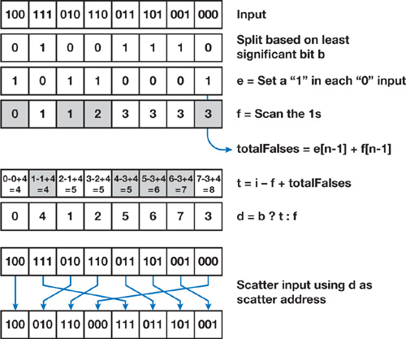
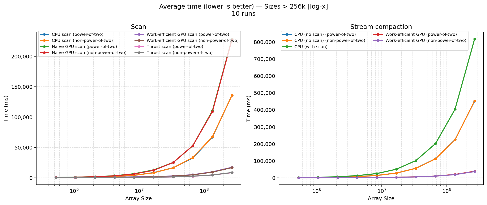
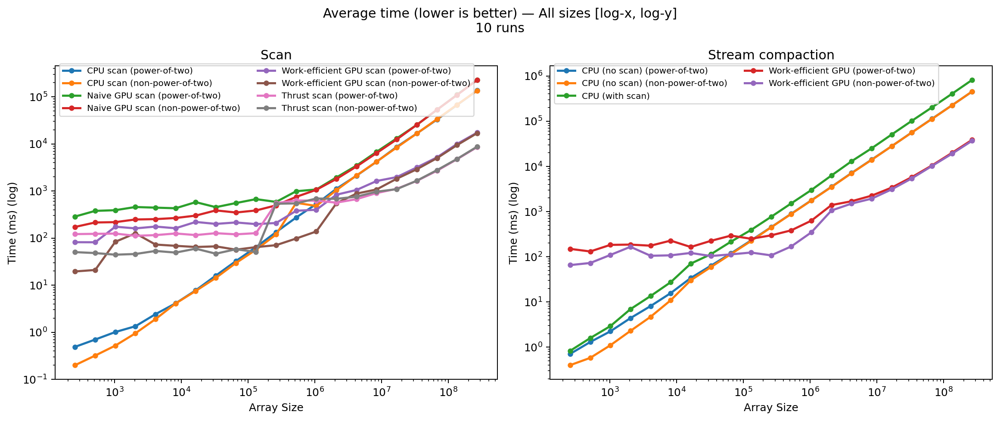
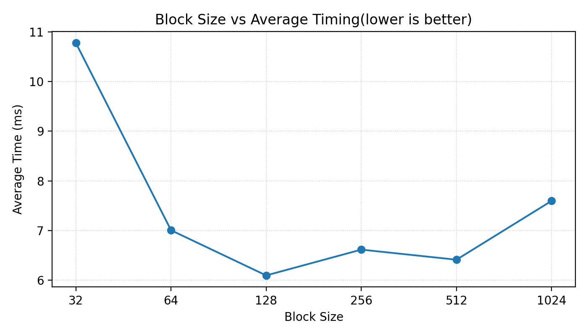
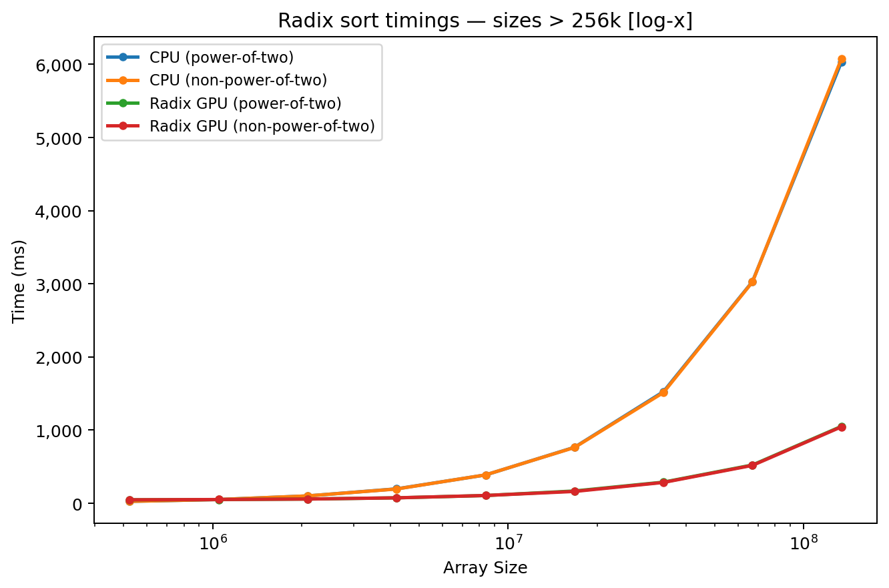
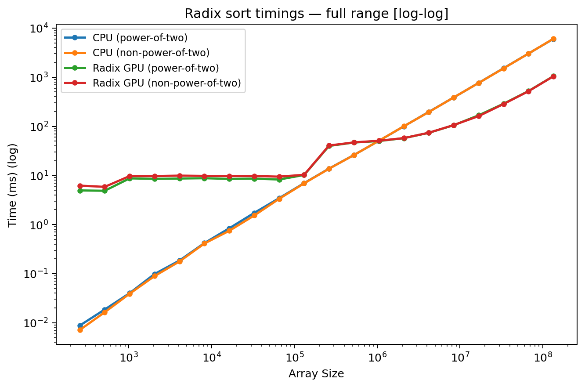
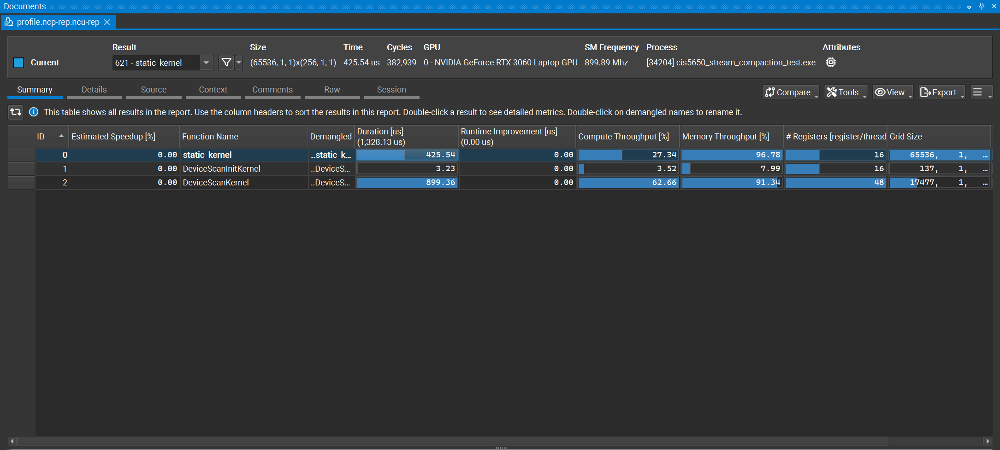

# CUDA Stream Compaction
* Hi! I am Vismay Churiwala, here are my socials:  
  * [LinkedIn](https://www.linkedin.com/in/vismay-churiwala-8b0073190/) | [Website](https://vismaychuriwala.com/)
* **System Specs (My Machine):**  
  * OS: Windows 11
  * CPU: AMD Ryzen 7 5800H with Radeon Graphics (8C/16T, 3.2GHz base)
  * RAM: 32GB DDR4
  * GPU: NVIDIA GeForce RTX 3060 Laptop GPU (6GB GDDR6)
  * CUDA Toolkit: 13.0
  * Driver Version: 581.15

---
This is a CUDA-powered parallel implementation of stream compaction. Stream compaction reduces arrays by retaining only non-zero values. This seems to be a fairly straightforward problem that can be coded sequentially in a couple of minutes, but as we will see, this is extremely slow on the CPU for large arrays and using a GPU to parallelize this process can be orders of magnitude faster.

Here are some cool features I have implemented:
* Using **Shared Memory (SM)** for efficient memory access on the GPU (as opposed to using global memory, which is more than 100× slower ([see more here](https://www.ce.jhu.edu/dalrymple/classes/602/Class13.pdf))).
* **Hardware optimization** via [bank conflicts](https://forums.developer.nvidia.com/t/how-to-understand-the-bank-conflict-of-shared-mem/260900) prevention.
* Recursive scanning to scan **arrays of arbitrary sizes** (tested up to 1B elements (2^30), which took 3470.59 ms).
* **Radix Sort** using Parallel Scan
* Naive and CPU-based implementations to compare and benchmark techniques.
* Customized testing code to collect, average, and plot GPU and CPU timings.

## CUDA Scan + Stream Compaction
Scan is a prefix-sum. I used the work‑efficient Blelloch scan (upsweep/downsweep) on the GPU so the total work stays O(n) and the depth is O(log n). Each block scans its chunk in shared memory. I used strided indexing to dodge bank conflicts, and I kept the loads/stores coalesced. For large inputs, I split the data into chunks and assign them to blocks. The blocks write their partial sums. I scan those recursively (so partial sums that don’t fit in a single block are scanned across multiple blocks), and then add the offsets back (uniform add) so it scales to arbitrary sizes and NPOTs.

Stream compaction rides on top of scan. First I build a bools array (0/1 flag per element, i.e., keep if value != 0). Then I exclusive‑scan the flags to get output indices, and scatter only the keepers. That makes the compaction stable and very GPU‑friendly. I include a naive version, a work‑efficient version, and a CPU baseline so you can sanity‑check correctness and see the speedups on both power‑of‑two and non‑power‑of‑two (NPOT) sizes.

## Radix Sort using CUDA
I implement an LSD integer radix sort on the GPU built on the same work‑efficient Blelloch scans used above. For each bit (0→31), I split elements into 0/1 buckets via bit tests, exclusive‑scan the flags to get stable write indices, and scatter into ping‑pong buffers. Blocks use shared memory with coalesced global accesses; NPOT inputs are handled by padding internal scan buffers while keeping counts based on the original length. The algorithm is stable, scales to large arrays, and currently targets non‑negative 32‑bit integers. A CPU `std::sort` baseline is included for correctness and performance comparisons.



[Source - NVIDIA](https://developer.nvidia.com/gpugems/gpugems3/part-vi-gpu-computing/chapter-39-parallel-prefix-sum-scan-cuda)
## Performance Analysis
I benchmarked each method across a range of sizes (both power‑of‑two and NPOT), averaged over 10 runs. The work‑efficient GPU scan/compaction wins big, especially as input grows; NPOT handling adds minor overhead but stays close.

Comparing scan and stream compaction for sizes ranging from 260K to 260M elements:

### Time vs Log(Size)


Here we can see how the timings for the naive GPU method and the CPU method increase much faster than the work‑efficient versions. This is true for both power‑of‑two and non‑power‑of‑two sizes (recall that we pad NPOT sizes to the next power of two). The NPOT cases have nearly the same timings as the power‑of‑two cases, with slight overhead. Below we highlight the differences more clearly by plotting the log‑log over an extended range of sizes. Note that the CPU implementation is not the serial version of the naive scan. I have tried to implement the fastest serial scan and compaction I can to have a good baseline.

### Log(Time) vs Log(Size)
 We plot a log-log plot to get a better idea of the differences below. This includes the whole range of values starting at 256 elements and going all the way to 256M values. Notice how the CPU version is faster until arrays are large enough to overcome the parallelization overhead. Also note how hardware optimizations make the work‑efficient scan much faster than the naive version. If I were to use global memory, I suspect my scan and compaction would have been a lot slower (closer to the naive scan).


You can find the raw images and variants in `plots/` if you want the linear‑scale or separate power‑of‑two and NPOT versions.

### Optimizing Block Size
I ran the work‑efficient compaction for multiple block sizes to get the best block size for my implementation. Here are the timings for 33M elements (2^25), averaged over 10 runs.

A block size of 128 seems to be a good choice for `Efficient::compact`.

### Radix Sort

I implemented radix sort using `Efficient::recursiveScan` to sort positive integer arrays of arbitrary lengths. I used `std::sort` for the CPU version to serve as a baseline.



Notice that just like our Efficient Scan implementation, the GPU Radix sort is much faster than the CPU version for sufficiently large sizes.



The timings for both powers of two and NPOT are very similar.

## Implementation

### CPU Scan and Compact
The CPU scan is a serialized scan that runs over the array and adds the previous element to the next elements serially. I made this implementation as simple as possible and haven't tried to replicate Naive scan serially since I wanted a good baseline against the GPU.
The CPU compact has two variants that compact with and without using scan.

### Naive Scan and Compact
The naive scan follows the implementation below:


This is an inclusive scan. I wrote a kernel `Naive::make_exclusive` that shifts the inclusive scan to the right and sets the first element to zero. I used ping-ponging buffers to calculate the scan across steps.

`Naive::compact` creates a bool array using `Common::kernMapToBoolean` and uses `Naive::scan` to get an array of indices. The output is then filled in by using the bool array and the array of indices in `Common::kernScatter`.
We use global memory throught this process, and there is a lot of wasted work, which makes the naive implementation very slow.

### Efficient Scan

`Efficient::recursiveScan` divides the array into chunks and each block uses shared memory. The blocks are scanned using `Efficient::multiscan` (which follows the implementation in [39.2](https://developer.nvidia.com/gpugems/gpugems3/part-vi-gpu-computing/chapter-39-parallel-prefix-sum-scan-cuda)). The sum of all elements in a chunk (the last element of the individual scan) is stored inside `blockSums`, which is then scanned again recursively using `Efficient::recursiveScan`. The output is then shifted using the `blockSums` array and this results in a complete scan of arbitrary sized arrays in parallel.

#### `Efficient::mutiscan`

`Efficient::multiscan` is based on the pre-scan implemented in [39.2.2](https://developer.nvidia.com/gpugems/gpugems3/part-vi-gpu-computing/chapter-39-parallel-prefix-sum-scan-cuda)(`Efficient::recursiveScan`). My implementation extends this to accommodate **arbitrary-sized** arrays. `multiscan` takes in arbitrary sized arrays in global memory and uses **shared memory** within each single block. It computes the scan for each chunk and stores the result to the global output. It also stores the last element from each chunk to `blockSums`. I have used strided indexing to **prevent bank conflicts** as suggested in [39.2.4]((https://developer.nvidia.com/gpugems/gpugems3/part-vi-gpu-computing/chapter-39-parallel-prefix-sum-scan-cuda)).

However, I noticed that the macros provided in 39.2.3 were incorrect, as the number of banks have increased to 32 in recent GPU architectures and the macro for CONFLICT_FREE_OFFSET(n) had been incorrectly calculated (see [blog](https://forums.developer.nvidia.com/t/conflict-free-offset-macro-why-and-how-does-it-work/343324)).

I replaced it with the correct macros:

**Correct Macros**:
```
#define NUM_BANKS 32
#define LOG_NUM_BANKS 5
#define CONFLICT_FREE_OFFSET(n) ((n) >>(LOG_NUM_BANKS))
```
Incorrect Macros:
```
// #define NUM_BANKS 16
// #define LOG_NUM_BANKS 4
// #define CONFLICT_FREE_OFFSET(n)((n) >> NUM_BANKS + (n) >> (2 * LOG_NUM_BANKS))
```

#### `Efficient::recursiveScan`

My implementation of `Efficient::multiscan` was working well until I started to scan arrays of very large sizes (~ 2M i.e. 2^21 elements). This is when I realized that the array of accumulated sums `blockSums` was getting too large to be scanned using a single Chunk. I considered using CPU::scan or a Naive Scan to fix this issue, but I knew that the performance hit would be a lot, especially in moving data between devices or allocation/reallocation. So I decided to use recursion to fix this issue.

recursiveScan accepts arbitrary-sized arrays, calls `Efficient::multiscan` to compute scan of individual chunks, collects `blockSums`; and recursively calls `Efficient::recursiveScan` to compute the scan of `blockSums`. After getting this scan, the output array(containing the scan of all elements) is shifted by the elements in `blockSums` using `Efficient::uniformAdd`. This gets around the issues of computing the scan of `blockSums` for large arrays that don't fit inside a single chunk.


### Thrust Scan
Thrust::scan is very simple, the code is as follows:
```
copy host -> device
thrust::device_vector<int> d_in(idata, idata + n);
thrust::device_vector<int> d_out(n);

timer().startGpuTimer();
// exclusive scan on device
thrust::exclusive_scan(d_in.begin(), d_in.end(), d_out.begin());
cudaDeviceSynchronize(); // ensure timing is correct
timer().endGpuTimer();

// copy device -> host
thrust::copy(d_out.begin(), d_out.end(), odata);
```
Even though thrust is CUDA's own implementation of exclusive scan, we can see that our work-efficient scan seems to perform better. This likely comes down to how we record the timings for the scan. There are a few possibilities I think might be causing this:

* The memory allocation  (`cudaMalloc`)for temporary arrays is probably happening after `thrust::exclusive_scan` is called, and is being counted in the GPU timing. This is not the case when we have finer control over where to insert the timer as in our other implementations.

* Although we pre-copy and allocate the data using `thrust::device_vector` for the thrust scan, the actual allocation might be happening asynchronously inside the timer loop.

* The GPU might not be warmed up and that can have some overhead. Recall how in all other methods we allocate and copy and do operations on arrays before starting the timer. 

I ran a profile on NSight Compute and got the following profile for thrust::exclusive_scan:

The operation is memory-limited, which makes sense for a scan. The compute throughput is low for all kernels, which means that the threads are waiting for memory access rather than compute.

`static_kernel` has especially low compute - this might be happening because the static kernel is allocating temporary arrays while the Scan kernel performs the actual scan, but this is just a guess without looking at the code.

### Radix Sort
I implemented a stable LSD radix sort that uses scan to partition the array by one bit at a time (least‑significant to most‑significant). Each pass is a stable split into 0‑bucket then 1‑bucket, so after 32 passes (for `int`) the array is fully sorted.

- Per‑bit flags: For bit `k`, I build `b1[i] = ((unsigned)idata[i] >> k) & 1` with `radix_to_bools`, and `b0[i] = 1 - b1[i]` via `negate_bools_into`.
- Indices via scan: I exclusive‑scan `b1` and `b0` with my work‑efficient `Efficient::recursiveScan` to get write indices `idxOnes` and `idxZeros`.
- Scatter (stable): I compute `totalOnes` from the last prefix element plus the last flag, then `totalZeros = m - totalOnes` (where `m` is the original length, not padded). `assign_indexes` writes zeros to `odata[idxZeros[i]]` and ones to `odata[idxOnes[i] + totalZeros]`, preserving original order within each bucket.
- Ping‑pong buffers: I alternate `dev_bufA`/`dev_bufB` between passes so each pass reads from one and writes to the other.

NPOT handling: I pad internal scan buffers up to the next power of two (`n = 1 << ilog2ceil(m)`) but keep all counts and scatters based on `m`. I also zero‑fill the tails of `b0`/`b1` when `n > m` so padding never contributes to totals. That keeps behavior identical for both power‑of‑two and NPOT sizes.

Timing notes: Allocation and the initial H2D copy are outside the GPU timer; the timer wraps only the 32 per‑bit passes. Scans reuse the same recursive work‑efficient routine used in stream compaction, so accesses stay coalesced and use shared memory within blocks.

Limitations/assumptions: Bit tests cast inputs to `unsigned` for correctness of shifts; my tests generate non‑negative data. If you need signed ascending order with negatives, you can post‑process or adjust the final pass to handle the sign bit specially.

## Testing and Plotting

The timings shown in this report are the exact times used by the CPU and GPU in calculating the scan. This does not include the times allocating memory for the scan function,copying memory between host and device etc. There are some nuances in `Efficient::scan` (`recursiveScan`) and `Thrust::scan` timings (discussed in more detail later), where intermediate arrays are allocated within the scan loop, so these are counted. But all other arrays like bools, indices etc. are preallocated and copied, and the output is copied to host after stopping the timers.

I rewrote some of the code in `main.cpp` to get a format easier to read algorithmically and plot. I then diverted the `std::cout` to a file `timings.txt` (See `\plots\data`), where I read the txt file using python and computed the averages over multiple runs and plotted it using python (see `\plots\code`). I did the same for optimizing blockSizes.

Original Output:
```
****************
** SCAN TESTS **
****************
    [  18  36  37  45  18  24   5  36  41   3  46  20  41 ...   3   0 ]
==== cpu scan, power-of-two ====
   elapsed time: 15.6374ms    (std::chrono Measured)
    [   0  18  54  91 136 154 178 183 219 260 263 309 329 ... 821845107 821845110 ]
==== cpu scan, non-power-of-two ====
   elapsed time: 16.7006ms    (std::chrono Measured)
    [   0  18  54  91 136 154 178 183 219 260 263 309 329 ... 821845015 821845057 ]
passed
==== naive scan, power-of-two ====
   elapsed time: 25.4879ms    (CUDA Measured)
passed
==== naive scan, non-power-of-two ====
   elapsed time: 25.2602ms    (CUDA Measured)
passed
==== work-efficient scan, power-of-two ====
   elapsed time: 3.4472ms    (CUDA Measured)
passed
==== work-efficient scan, non-power-of-two ====
   elapsed time: 2.82419ms    (CUDA Measured)
passed
==== thrust scan, power-of-two ====
   elapsed time: 1.5953ms    (CUDA Measured)
passed
==== thrust scan, non-power-of-two ====
   elapsed time: 1.8985ms    (CUDA Measured)
passed

*****************************
** STREAM COMPACTION TESTS **
*****************************
    [   1   3   1   2   1   3   2   1   1   1   0   2   1 ...   2   0 ]
==== cpu compact without scan, power-of-two ====
   elapsed time: 55.6823ms    (std::chrono Measured)
    [   1   3   1   2   1   3   2   1   1   1   2   1   2 ...   3   2 ]
passed
==== cpu compact without scan, non-power-of-two ====
   elapsed time: 57.0865ms    (std::chrono Measured)
    [   1   3   1   2   1   3   2   1   1   1   2   1   2 ...   2   3 ]
passed
==== cpu compact with scan ====
   elapsed time: 100.3ms    (std::chrono Measured)
    [   1   3   1   2   1   3   2   1   1   1   2   1   2 ...   3   2 ]
passed
==== work-efficient compact, power-of-two ====
   elapsed time: 5.62285ms    (CUDA Measured)
    [   1   3   1   2   1   3   2   1   1   1   2   1   2 ...   3   2 ]
passed
==== work-efficient compact, non-power-of-two ====
   elapsed time: 5.44666ms    (CUDA Measured)
    [   1   3   1   2   1   3   2   1   1   1   2   1   2 ...   2   3 ]
passed
Press any key to continue . . .
```
Testing Output:
```
** SCAN TESTS **
SIZE= 33554432
17.3174
16.2627
25.3695
25.0887
3.09696
2.87846
1.57798
1.72134

58.9666
61.3826
103.195
5.72349
5.43437
```

Radix Sort:
```
**********************
** RADIX SORT TESTS **
**********************
    [ 18284 4031 17105 7014 14969 10298 28093 25039 9467 30141 2902 28383 25462 ... 19308   0 ]
==== cpu sort, power-of-two ====
   elapsed time: 1518.95ms    (std::chrono Measured)
    [   0   0   0   0   0   0   0   0   0   0   0   0   0 ... 32767 32767 ]
==== cpu sort, non-power-of-two ====
   elapsed time: 1535.09ms    (std::chrono Measured)
    [   0   0   0   0   0   0   0   0   0   0   0   0   0 ... 32767 32767 ]
==== Radix Sort, power-of-two ====
   elapsed time: 310.548ms    (CUDA Measured)
    [   0   0   0   0   0   0   0   0   0   0   0   0   0 ... 32767 32767 ]
passed
==== Radix Sort, non-power-of-two ====
   elapsed time: 5.69754ms    (CUDA Measured)
    [   0   0   0   0   0   0   0   0   0   0   0   0   0 ... 32767 32767 ]
passed
```

Testing Output:
```
SIZE= 33554432
1516.88
1507.03
287.379
303.782
```
I tried a for loop in C++ to get multiple such runs, but the code was running asynchronously and I was getting incorrect timings. I tried using `cudaDeviceSynchronize()` and/or `cudaDeviceReset()` between calls, but these didn't solve my timings issues.

Since the number of runs weren't very large, I ended up running each input multiple times in Visual Studio and appending to a timings.txt using `iostream`.

#### Notes

- Likely Performance Bottlenecks:
  - CPU - Serialization, fundamentally what we're trying to solve
  - Naive - Global I/O reads and writes, unused threads in blocks.
  - Thrust - Likely appears slow due to difference in time-calculation.
  - Efficient-Work - Quite fast - other optimizations include ping-ponging buffers in `recursiveScan` to reduce allocation.
- Memory allocation takes time - scan is quite memory-intensive, curious about ways to reduce memory footprint. Also curious to see how my scan compares to thrust when comparing wall-clock time.
- Would be interesting to quantify the speedup from reducing Bank-Conflicts compared to traditional indexing. Also same with SM.
- Radix sort on a single block seems straightforward, merging multiple blocks seems challenging.
