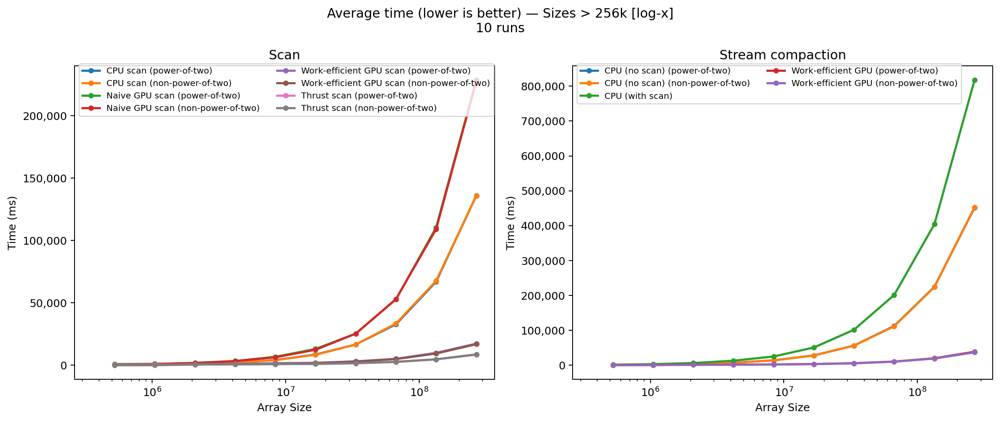

# CUDA Stream Compression
* Hi! I am Vismay Churiwala, here are my socials:  
  * [LinkedIn](https://www.linkedin.com/in/vismay-churiwala-8b0073190/) | [Website](https://vismaychuriwala.com/)
* **System Specs (My Machine):**  
  * OS: Windows 11
  * CPU: AMD Ryzen 7 5800H with Radeon Graphics (8C/16T, 3.2GHz base)
  * RAM: 32GB DDR4
  * GPU: NVIDIA GeForce RTX 3060 Laptop GPU (6GB GDDR6)
  * CUDA Toolkit: 13.0
  * Driver Version: 581.15

---
This is a CUDA-powered parallel implementation of Stream Compression. Stream Compression is a method of reducing large arrays of numbers, including only non-zero values. This seems to be a fairly straightforward problem that can be coded sequentially in a couple of minutes, but as we will see, this is extremely slow on the CPU for large arrays and using a GPU to parallelize this process can be orders of magnitude faster.

Here are some cool features I have implemented:
* Using Shared Memory for Efficient Memory Access on the GPU (as opposed to using Global Memory, which is > 100x slower \[ [see more here](https://www.ce.jhu.edu/dalrymple/classes/602/Class13.pdf)\]).
* Hardware Optimization via [Bank-Conflict](https://forums.developer.nvidia.com/t/how-to-understand-the-bank-conflict-of-shared-mem/260900) prevention.
* Recursive scanning to scan arrays of arbitrary sizes (tested up to 1B elements (2^ 30) which took 3470.59 ms).
* Naive and CPU-based implementations to compare and benchmark techniques.
* Customized testing code to collect, average and plot GPU and CPU timings.

## CUDA Scan + Stream Compaction
Scan is a prefix-sum. I used the work‑efficient Blelloch scan (upsweep/downsweep) on the GPU so the total work stays O(n) and the depth is O(log n). Each block scans its chunk in shared memory, I used strided indexing to dodge bank conflicts, and I kept the loads/stores coalesced. For big inputs, the input is split into chunks, and assigned to blocks. The blocks write their partial sums, I scan those recursively (So that the partial sums which cannot be fit into a single block can be scanned using multiple blocks again), and then add the offsets back (uniform add) so it scales to arbitrary sizes and NPOTs.

Stream compaction rides on top of scan. First I build a bools array (0/1 flag per element, i.e., keep if value != 0). Then I exclusive‑scan the flags to get output indices, and scatter only the keepers. That makes the compaction stable and very GPU‑friendly. I include a naive version, a work‑efficient version, and a CPU baseline so you can sanity‑check correctness and see the speedups on both power‑of‑two and non‑power‑of‑two sizes.

## Performance Analysis
I benchmarked each method across a range of sizes (both power‑of‑two and NPOT), averaged over 10 runs. The work‑efficient GPU scan/compaction wins big, especially as input grows; non-power-of-two handling adds minor overhead but stays close.

Comparing scan and stream compaction for sizes ranging from 260K elements 260M elements:

### Time vs Log(Size)

Here we can see how the timings for Naive GPU method and CPU method are both increasing much faster than the Work-Efficient versions. This is true for both powers of two sizes and non-powers of two sizes (Recall that we pad the non-powers of two sizes to the next power of two). Below we highlight the differences in the timings more clearly by plotting the log-log over an extended range of sizes. Note that the CPU implementation is not the serial version of the Naive scan, I have tried to implement the fastest serial scan and compaction I can to have a good baseline.

### Log(Time) vs Log(Size)
 We plot a log-log plot to get a better idea of the differences below. This includes the whole range of values starting at 256 elements and going all the way to 256M values. Notice how the CPU version is faster until we have arrays big enough to take advantage of the parallelization overhead. Also, note how hardware optimization makes the Efficient scan much faster than the naive version. If I were to use global memory, I suspect my scan and compaction would have been a lot slower (closer to Naive scan).

You can find the raw images and variants in `plots/` if you want the linear‑scale or separate power of two and non-power of two versions.

### Optimizing BlockSize
I ran the Efficient Compaction for multiple Block Sizes to get the best blockSize for my implementation. Here are the timings for 33M elements (2 ^ 25), and averaged them over 10 runs.

A blockSize of 128 seems to be a good choice to use in my implementation of Efficient::compact.